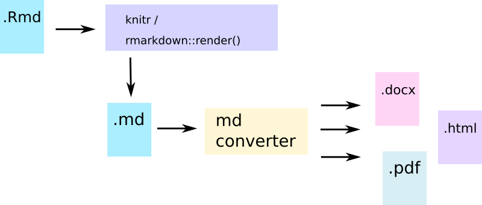

```{r echo=FALSE,results="hide",message=FALSE,warning=FALSE}
library(tidyverse)
```

## Todays plan

 * While we are at it: tidyverse, while you are fresh and rested ;)
 * Rmarkdown and manuscript writing

# Tidyverse

## Why tidyverse

> * Cleaner code
> * Useful automatisation
> * Great data processing language
> * Coherent structure of packages

## Why *not* tidyverse

> * Changes the logic of the language
> * Makes your code depend on tidyverse
> * Fewer people will understand your code
> * Easy things are even easier, hard things are even harder
> * Useful mostly for data frames and lists (but that's not entirely true)
> * quickly evolving: all the time new functionality replaces old functionality

## My take

> * When writing published packages, I try to avoid tidyverse. I rather
    re-implement the functionality then make my package depend on tidyverse.
> * (and never make the package dependent on the `tidyverse` meta-package)
> * If absolutely necessary, I import single packages and single functions
> * I use tidyverse ad lib when writing reports and manuscripts (so
    basically in Rmarkdown)


# My god, it's full of packages

## Tidyverse overview

{width=600px}

## Tidyverse packages

|Package|What does it do|What does it replace / introduce|
|-------|---------------|---------------------|
|rlang|Main tidyverse framework, a redefinition of R|A lot of base R constructs; introduces quosures|
|tibble|New model of data frames|data frames|
|dplyr|Main data frame manipulation tool|data frame operations|
|tidyr|Manipulating data formats, pivoting|e.g. reshape & co|
|magrittr|Introducing pipes to R|The `%>%` operator & co|
|purrr|Functional constructs|lapply, sapply & co|
|readr|read and write data frames|read.table & co|
|forcats|dealing with factors|introduces goodies for working with factors|
|stringr|dealing with strings|introduces goodies for working with strings|
|broom|standardizing output of common functions|`summary()`|
|ggplot2|Graphics based on "Grammar of graphics"|replaces base plotting utilities|

## How to use tidyverse

 * load with `library(tidyverse)`
 * some packages (e.g. `magrittr`) need to be loaded separately
 * never load `plyr` after `dplyr`. In fact, do not use `plyr`

# Introducing tibbles

## Data frames are lists

Since we are talking about data frames, did you notice that a data frame
*is a list*?

```{r}
is.list(data.frame(ID=1))
```

 * data frames look like matrices, but are not matrices!
 * they are a special type of list

## The problem with data frames

 * It makes (mathematical) sense that a column or row of a matrix is not a matrix, but a
   vector, since one-dimensional matrix is a vector
 * however, `df[,1]` is a vector, but `df[1,]` is not (and cannot be! why?)
 * data frames (and base R data frame operations) have nasty habits of
   modifying your data: changing column names, turning columns into factors
   etc.

## So many ways to skin a cat

data.frame has so many problems. Luckily, there are also so many solutions.

 * data.table / DT
 * DataFrame (BioConductor)
 * colorDF ;-)
 * tibble (tidyverse, formerly known as data\_frame)
 * special objects (ExpressionSet, limma/edgeR objects etc.)

## What is special about tibble

 * Hadley Wickham hates row names (and he has reasons)
 * tbl[,3] returns a tbl rather than a vector
 * nicer printing (but... colorDF is WAY better ;-))
 * extra properties (`group_by` etc.)
 * can give major headache when used in connection with Bioconductor

## Fine, but...

If you want to view more than the default portion of the tibble, do

```{r,results="hide"}
print(starwars, n=Inf, width=Inf)
```

Row names: convert them to a column with `rownames_to_column`, use filter() instead of `[`

## Reading data with readr

 * read\_{tsv,csv,...}, write…
 * better, cleaner, faster
 * explicit
 * will never turn a string into a factor

## Reading data

---------------------------- ------------------------------- -------------------------- --------------------------
Data type                    Function                        Tidyverse                  Notes                     
---------------------------- ------------------------------- -------------------------- --------------------------
TSV / TAB separated values   `read.table()`                  `read_tsv()`,              Tab is `\t`.              
                                                             `read_delim()`             A very general and        
                                                                                        customizable function
                                                                                                                  
CSV / comma separated        `read.csv()`,                    `read_csv()`,             a wrapper around          
                                                              `read_delim()`            `read.table()`            
                                                                                                                  
XLS (old Excel)                                               `read_xls()`,             Avoid old Excel format!
                                                              `read_excel()`            From the                  
                                                                                        `readxl`
                                                                                        package.
                                                                                                                  
XLSX (new Excel)                                              `read_xlsx()`,            From the `readxl` package.      
                                                              `read_excel()`            You need to                     
                                                                                        provide the
                                                                                        sheet number
                                                                                        you wish to
                                                                                        read. 
                                                                                        Note: returns a tibble,
                                                                                        not a data frame! 
---------------------------- ------------------------------- -------------------------- --------------------------


## Exercise session [2/1](../Exercises/day_2.md)

## Introducing Pipes

Remember? In R, almost everything is a function, but some functions are special: they
look like operators.

```{r echo=TRUE,results="markdown"}
vec <- 1:10
`[`(vec, 2)

`+`(1, 2)
```

## Introducing Pipes

It is possible to create your own functions which work like operators.

```{r echo=TRUE,results="markdown"}
`%cup%` <- function(x, y) union(x, y)
1:10 %cup% 2:15

`%cap%` <- function(x, y) intersect(x, y)
1:10 %cap% 2:15
```

The names for the operators here come from the $\LaTeX$ symbol names for
mathematical set operators $\cup$ ("cup") and $\cap$ ("cap").

<div class="columns-2">
</div>

## Simple beginner pipe

```{r}
`%=>%` <- function(a, func) {
  func(a)
}

mtcars %=>% head

## same as head(mtcars)
```


## Introducing Pipes

How about an operator that calls just any function? 

```{r, eval=FALSE}
a %>% some_func(b)

## is the same as

`%>%`(a, some_func(b))

## which then (with magic) becomes
some_func(a, b)
```

If you want to know more about this magic, read [Advanced R](http://adv-r.had.co.nz/) by Hadley Wickham. Not an easy read, though.

## Introducing Pipes

Pipes work for *anything*, not just the tidyverse!

```{r}
df <- data.frame(1:1000)

df %>% head
```

## Pipes in full: magrittr package

{width=600px}

## Ceci n'est pas une pipe

Magrittr defines a number of aliases – and of course the pipe operator,
`%>%`.
However, there is more to this package.

 * aliases (extract, set\_names etc.)
 * `%$%` operator (pipe version of `attach`)
 * `%<>%` operator (instant assignment)


## Simplified function notation

OK, so you remember than in the following

```{r}
func <- function(.) { paste("Hello, ", .) }
func("Dolly")
```

`func` is a variable holding a function; the actual function is the thing
on the right. Also, dot is a simple variable name, just like `foo` or
`size`.

## Passing anonymous functions as arguments

The following are equivalent:

```{r,eval=FALSE}
func <- function(.) { paste("Hello, ", .) }
some_other_function(arguments, func)
some_other_function(arguments, function(.) { paste("Hello, ", .) })

## no need for braces with only one statement
some_other_function(arguments, function(.) paste("Hello, ", .))
```

## Passing anonymous functions as arguments

Programmers are lazy. Tired of writing `function(.) { ... }` they came up
with a shorthand notation:

```{r,eval=FALSE}
some_other_function(arguments, ~ paste("Hello, ", .))
```

Here, the tilde (`~`) is the same as `function(.)`. That's it, no magic
other than that. (almost no magic, sometimes the number of arguments is
larger than 1, we will come to that later).

We can only use it in tidyverse!!


# dplyr

## dplyr: managing data

 * select, mutate, filter, rename, pull, arrange, all\_of, everything
 * distinct, sample\_{n,frac}, add\_count, add\_tally
 * summarise, across, where
 * group\_by

(Demo)

## select

Select columns from data:

    starwars %>% select(name)
    mtcars %>% select(mpg, Cylinder=cyl)
    mtcars %>% select(starts_with("d"))
    mtcars %>% select(everything())
    starwars %>% select(name:mass)
    starwars %>% select(where(is.numeric))

## Selecting in tidyverse

Note that we are not using quotes around the column names. These are so
called *data variables*. In base R, we can also do something like this:

```{r,eval=FALSE}
# instead of starwars$name
with(starwars, paste("Name:", name))
```


## mutate

Create new columns

    mtcars %>% mutate(lp100km=282.5/mpg)

## filter

Select rows from the data

    mtcars %>% filter(hp > 100)
    mtcars %>% filter(hp > 100 & cyl < 8)

## pull

Get a single column as a vector

    mtcars %>% pull(mpg)

## arrange

Sort the rows of the data 

```r
mtcars %>% arrange(mpg)
```

## Exercise Session 2/2

# Grouping in dplyr

## `group_by`

`group_by` introduces a grouping in a data frame that can be then used by
`summarise` to calculate something reasonable. This is a lot like `tapply`.

```r
mtcars %>% group_by(cyl) %>%
  summarise(m.hp=mean(hp))
```

## `group_by`

This has the advantage that you can define a whole range of calculations
based on any column in the data:

```r
mtcars %>% group_by(cyl) %>%
  summarise(m.hp=mean(hp), m.wt=mean(wt))
```

Or you can use a more complex function:

```r
## which planet has the largest mean BMI?
starwars %>% group_by(homeworld) %>%
  summarise(bmi = mean(mass/(height/100)^2)) %>%
  arrange(bmi)
```

## Weird, weird world (heavy stuff)

What if we don't want to choose a variable by hand?

```{r}
## note: mean is now an argument to across!!!
mtcars %>% group_by(cyl) %>% summarise(across(everything(), mean))
```

## Weird, weird world (heavy stuff)

Or, if we want something more complex, we use the `~ ...` form:

```{r}
mtcars %>% group_by(cyl) %>% summarise(across(everything(), ~ mean(.)/sd(.)))
```

The dot (`.`) stands for the argument.  (remember? dot is just a normal
character, it can be a variable name!)

## Even more heavy stuff


```{r}
starwars %>% summarise(across(where(is.numeric), mean))
starwars %>% summarise(across(where(is.numeric), ~ mean(., na.rm=T)))
```

## ....aaaaaand some more

```{r}
starwars %>% 
  summarise(across(where(~ is.numeric(.) & sum(is.na(.)) < 10), ~ mean(., na.rm=T)))
```

 * where takes a function as an argument, so instead of the variable
   holding a function we can use an anonymous function. It allows selecting
   the variables for which this function gives a TRUE value
 * across takes two arguments; first is a column selection (where, all\_of,
   everything etc.); second is a function.


## Exercise Session 2/3

# Wide and Long data format

## Wide and Long format

 Long (stacked, tall, narrow) advantages:

  * easier to filter, process, visualize, do statistics with
  * focused on measurement ("patient ID" or equivalent is a covariate, and so is measurement type)

 Wide (un-stacked) advantages:

  * groups data by a covariate ("patient ID")
  * can be easier to manage (each column one measurement type)
  * can be more compact

## Long vs wide data

 `pivot_longer()`, `pivot_wider()`

## Converting from wide to long:

```{r, results="hide"}
wide <- read.table(header=TRUE, text='
 subject sex control cond1 cond2
       1   M     7.9  12.3  10.7
       2   F     6.3  10.6  11.1
       3   F     9.5  13.1  13.8
       4   M    11.5  13.4  12.9
')
pivot_longer(wide, control:cond2, names_to="key",
             values_to="measurement")
```

## Converting from wide to long:

```{r}
wide <- read.table(header=TRUE, text='
 subject sex control cond1 cond2
       1   M     7.9  12.3  10.7
       2   F     6.3  10.6  11.1
       3   F     9.5  13.1  13.8
       4   M    11.5  13.4  12.9
')
pivot_longer(wide, control:cond2, names_to="key",
             values_to="measurement")
```


## Converting from long to wide

```{r}
long <- read.table(header=TRUE, text='
 subject  sampleID sex condition measurement
       1  ID000001 M   control         7.9
       1  ID000002 M     cond1        12.3
       1  ID000003 M     cond2        10.7
       2  ID000004 F   control         6.3
       2  ID000005 F     cond1        10.6
       2  ID000006 F     cond2        11.1
       3  ID000007 F   control         9.5
       3  ID000008 F     cond1        13.1
       3  ID000009 F     cond2        13.8
')
```

## Converting from long to wide

```{r}
## not what we wanted!!!
pivot_wider(long, names_from="condition", values_from="measurement")
```

What happened: all three remaining cols (subject, sampleID and sex) were
used *together* as an identifier. Since sampleID is unique for each row,
for sampleID ID000001 we only have a value for control, but no value for
cond1 and cond2. Thus,
we
got a table with as many rows as in the long format, with plenty of NA's! 

## Converting from long to wide

```{r}
## Instead: 
pivot_wider(long, id_cols=subject, names_from="condition", values_from="measurement")
```

## Long vs wide data: which one to choose?

 * What is the target of the data?
    * analysis, storage, data exchange: long format
    * results presentation, overview: wide format (possibly)
 * What is the unit of observation?
    * one unit = one row


## group\_by

Essentially, add information to the tibble that the data is grouped by a
variable. This does not change the actual data!

```{r}
identical(table2, table2 %>% group_by(country))
identical(as.data.frame(table2), 
          as.data.frame(table2 %>% group_by(country)))
```

You can then use several other functions.

## Use with caution!

While tidyverse is great for interactive work, you should use it with
caution in your functions:

```{r eval=FALSE}
foo <- function(df) {
  cols <- c("sex", "age")
  df <- df %>% select(cols)

  # ... do something

  return(df)
} 
```

What happens when df contains `cols`?

## Solution

Be wary of tidyverse shortcuts. Always assume the worst case scenario and
be explicit in your code:

```{r eval=FALSE}
# make sure you select columns from variable 
# and not by name
df <- df %>% select(all_of(cols))

# or, to use all but the columns in cols
df <- df %>% select(!all_of(cols))
```


## Of mice and men

```{r, out.width = "800px",echo=FALSE}
knitr::include_graphics("images/pnas_1.png")
```

## Of mice and men

<table><tr><td>
```{r, out.width = "400px",echo=FALSE}
knitr::include_graphics("images/pnas_res_1.png")
```
</td><td>

 * No or little correlation between transcriptomic responses in mouse
   models and human models: $r^2 < 0.1$ – less than 10% of variance
   explained

 * No similarity in identified functions
   
</td></tr></table>

## Of mice and men

```{r, out.width = "800px",echo=FALSE}
knitr::include_graphics("images/pnas_1.png")
```

```{r, out.width = "800px",echo=FALSE}
knitr::include_graphics("images/pnas_2.png")
```

## Of mice and men

<table><tr><td>
```{r, out.width = "400px",echo=FALSE}
knitr::include_graphics("images/pnas_res_1.png")
```
</td><td>

 * Strong correlation between mouse and human transcriptomic responses for
   genes which are regulated in one or the other condition:
   $\rho \geq 0.5$; change direction correlated

 * Similar functions for similarly regulated genes
</td></tr></table>


## Reproducibility, Repeatability, Replicability


 * **Repeatability:** you can repeat your calculations precisely
 
 * **Replicability:** Others can repeat your calculations precisely.

 * **Reproducibility:** Other approaches to the same problem give
   compatible results.

*McArthur SL. Repeatability, Reproducibility, and Replicability: Tackling
the 3R challenge in biointerface science and engineering.*

## Of mice and men


<table><tr><td>
```{r, out.width = "400px",echo=FALSE}
knitr::include_graphics("images/pnas_1.png")
knitr::include_graphics("images/pnas_2.png")
```
</td><td>
 * None of the papers was replicable, because precise description of
   methods leading from data to results was missing. 


 * At best, we were able to *roughly* reproduce the results using guesswork
   and custom code


</td></tr></table>


# (R)markdown


## markdown

Markdown is a markup language: a way of indicating to the computers which
parts of our text mean what, e.g. what is a header, what is a bullet list
etc. Markdown is very, very simple and easy to read even when you are human
(unlike XML or HTML).


## Markdown basics

 * Headers: `#`, `##`, `###`…
 * *italic* `*italic*` or `_italic_`
 * **bold** `**bold**` or `__bold__`
 * bullet lists: start with ` *` (space before!)
 * numbered lists: start with ` 2.` (space before!)
 * Superscript: a^2^ `a^2^`, subscript: a~2~ `a~2~`

## So much more

 * tables (you can produce them in R with `kable` or `pander`)
 * code: demarkated using backticks (`` ` ``, `` ``` ``)
 * references: need a BibTeX file (you can get it from google scholar!)
 * images: ``
 * mathematical notations: $\chi^2 \sim - 2 \times \log\sum_{i=1}^k p_i$

$$X = \begin{bmatrix}1 & x_{1}\\
1 & x_{2}\\
1 & x_{3}
\end{bmatrix}$$

## Rmarkdown




## Using R in markdown for fun and profit

Chunks:


```{r}
## this is R code inside of a chunk
plot(density(rnorm(10000)))
```

Chunks have several options which determine how the output looks like,
what type of graphics is produced (size, resolution) whether you can see
the R code etc. etc.

## Using R in markdown for fun and profit

Inline R code:

    The mtcars data set has `r '\x60r nrow(mtcars)\x60'` rows.

Result:

The mtcars data set has `r nrow(mtcars)` rows.

## Using R in markdown for fun and profit

Tables:

```{r}
library(knitr)
kable(mtcars[1:4, ])
```

## Exercise session [2/5](../Exercises/day_2.md)

## More on Rmarkdown

 * the YAML header
 * adding references
 * bookdown

## YAML header

 * information about how the document should be rendered
 * formatting options
 * when you select options from Rstudio, they will modify the YAML header
   (which is a good thing)
 * contains title, author, abstract etc.

## References

 * By default, always at the end of the document
 * open a new file, call it `bibliography.bib` or similar
 * go to Google scholar, search for a paper, click on "BibTeX" and copy the
   contents to the file
 * add a line to the header of the Rmarkdown document:
 
       bibliography: "bibliography.bib"
 * insert references like this: `[@weiner2018metabolite]` which generates: [@weiner2018metabolite]

## References: journal style

 * go to [https://www.zotero.org/styles](https://www.zotero.org/styles) or
   [https://github.com/citation-style-language/styles](https://github.com/citation-style-language/styles)
 * find your journal and download the csl file (e.g. `nature.csl`). Save it
   to where your Rmarkdown document is.
 * In your YAML header, enter

       csl: nature.csl

## Quick exercise

 Add a reference to your markdown document
  
  * go to google scholar, find a paper (e.g. the paper of Altschul on
    BLAST)
  * click on "cite". Then, click on BibTeX. Copy the text and paste it into
    a document called "bibliography.bib"
  * note the citation label in the first line (`altschul1997gapped`)
  * save the document where your Rmarkdown document is.
  * add the bibliography line to the YAML header
  * enter the citation `[@altschul1997gapped]`
  * knit the document and enjoy the result

## Bookdown

 Bookdown is an extension of Rmarkdown to make writing books easy

 * referencing items (figures, equations etc.)
 * each chapter is one file
 * tons of hacks for specific occasions

## Manuscript writing with Rmarkdown


* Advantages: you can easily collaborate with Word collaboration options
* Disadvantages: manually entering output from R results in frequent
  mistakes; also, it is tedious and boring

## Manuscript writing with Rmarkdown


* Disadvantages: hard to collaborate, you need to manually enter all the
  remarks from your co-authors
* Advantages: easy, automatic updates of the manuscript; no manual editing
  of figures or tables; no worries about the bibliography; easy to convert
  a report to a presentation and a paper; easy to quickly see the effects
  of one small change on your whole manuscript; you can use github for your
  manuscripts!

## Presentations with Rmarkdown

 * Usually produces a HTML which can be viewed in any browser
 * Two options are probably best suited for most purposes:

    * `ioslides_presentation` (this one); advantage: a single file
    * `xaringan`: better, nicer, cooler, but multiple files


